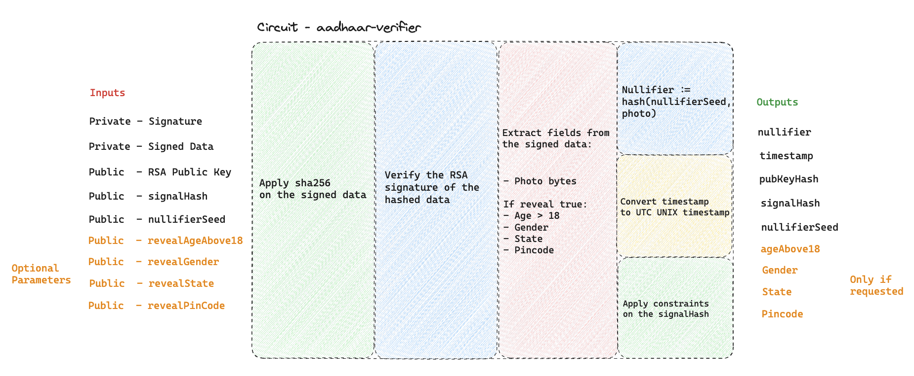

# How Does It Work?

## Anon Aadhaar: Verifying Aadhaar Documents with RSA

### Introduction

Anon Aadhaar is a zero-knowledge protocol designed to enable Aadhaar citizens to prove their possession of an Aadhaar document issued and signed by the government. This process ensures anonymity by utilizing the [Aadhaar secure QR code](https://uidai.gov.in/en/ecosystem/authentication-devices-documents/qr-code-reader.html), presents on e-Aadhaar and Aadhaar print-letter, preserving the confidentiality of the Aadhaar number.

### Workflow

#### RSA and Document Verification

At the core of this verification process lies RSA, a powerful cryptographic signature algorithm. RSA involves a private key used for signing and a corresponding public key used for verification of signatures. The innovative part of the Anon Aadhaar protocol is that this verification happens inside of a circuit, and the process results in a zk SNARK proof, hidding all the personal information needed to verify the signature. Resulting in a proof that attest indetity without revealing it.

Here are the steps happening while generating the proof:

### 1. **Extract and process the data from the QR code**:

- Read the QR code and extract both the signature and the signed data as bytes arrays
- Verifying the signature outside of the circuit to make sure the document is signed
- Fetching the official UIDAI public key, to use it as circuit input, to ensure it's RSA signed from the right authority
- Hash the signal

##### Required Data to generate the Aadhaar proof

- **From the QR Code**:
  - Bytes of the signed data.
  - Bytes of the RSA signature.
- **External to the QR Code**:
  - Indian government's RSA public key (that can be found [here](https://www.uidai.gov.in/en/916-developer-section/data-and-downloads-section/11349-uidai-certificate-details.html)).
  - A signal.
  - A nullifier Seed

### 2. **Generate an Anon-Aadhaar Proof**:

This process involves several operations in Circom circuits to ensure the privacy and integrity of your Aadhaar data while proving its authenticity without revealing personal information:

- **Apply the SHA-256 on the Signed Data**: This step involves checking the integrity and authenticity of the signed data by verifying its SHA-256 hash, as it's the hash that is signed by the RSA algorthm.

- **Verify the RSA Signature of the Hashed Data**: After verifying the data's hash, the next step is to authenticate the source of the data by verifying the RSA signature. This ensures that the data and its hash were indeed signed by the holder of the private key, in this case the UIDAI, offering a layer of security against data tampering.

- **Extract the photo bytes from the Signed Data**: The bytes of the photo are extracted to compute the nullifier.

- **Extract Identity Fields if requested**: If your app request to reveal one of the field from the identity the circuit will reveal it in its output. There only four fields that could be revealed (Age > 18, Gender, State, Pincode). Note that by default the Prover will reveal nothing from the ID.

- **Compute Nullifiers**: Nullifier is a unique identifiers derived from data fields, used to prevent double-spending or duplicate proofs without revealing the actual data. This step is crucial for maintaining privacy while ensuring the uniqueness and validity of the proof. To read more about Nullifiers.

- **Convert Timestamp from IST to UNIX UTC Format**: The timestamp associated with the data is converted into a UNIX UTC format. This standardization of time representation ensures consistency across different systems and platforms, facilitating verification processes that require time validation.

- **"Signing" the SignalHash**: The final step involves applying a contraints on the signalHash as part of the proof generation process. This act as a marker to the proof, that let the user to commit to a certain signal, while generating the proof. Note, that it's an optionnal parameter and it will be set as 1 by default in the SDK, it's mainly used to prevent from on-chain front-running or ERC-4337 integration.

