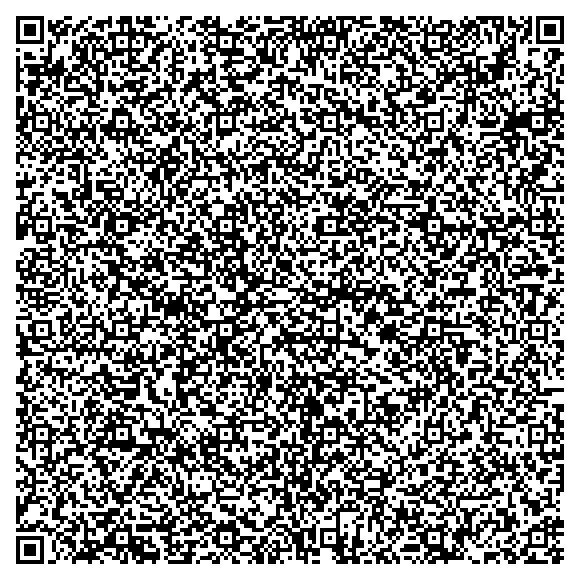

# Quick setup

## Install the `@anon-aadhaar/react` package

with npm

```javascript
npm install @anon-aadhaar/react
```

with yarn

```javascript
yarn add @anon-aadhaar/react
```

## Add the AnonAadhaar Provider

This needs to be **at the root of your app** add the AnonAadhaar Provider and initialize it with your app ID:

```tsx
import "@/styles/globals.css";
import type { AppProps } from "next/app";
import { AnonAadhaarProvider } from "anon-aadhaar-react";

export default function App({ Component, pageProps }: AppProps) {
  return (
    <AnonAadhaarProvider>
      <Component {...pageProps} />
    </AnonAadhaarProvider>
  );
}
```

The SDK is initially configured to validate a real Aadhaar card by default. You can use test Data by passing `_useTestAadhaar` variable to true.

```tsx
import "@/styles/globals.css";
import type { AppProps } from "next/app";
import { AnonAadhaarProvider } from "anon-aadhaar-react";

export default function App({ Component, pageProps }: AppProps) {
  return (
    <AnonAadhaarProvider _useTestAadhaar={true}>
      <Component {...pageProps} />
    </AnonAadhaarProvider>
  );
}
```

## Add the AnonAadhaar connect button and hook

```js
import { LogInWithAnonAadhaar, useAnonAadhaar } from "anon-aadhaar-react";
import { useEffect } from "react";

export default function Home() {
  const [anonAadhaar] = useAnonAadhaar();

  useEffect(() => {
    console.log("Anon Aadhaar status: ", anonAadhaar.status);
  }, [anonAadhaar]);

  return (
    <div>
      <LogInWithAnonAadhaar />
      <p>{anonAadhaar?.status}</p>
    </div>
  );
}
```

Now your users can log into your app by generating an `anonAadhaarProof`, this button will open a modal and let the user upload his Aadhaar card pdf and its certificate.

Once the user is 'logged-in' you can access and display the proof.

## Display the anon Aadhaar proof

```jsx
import {
  LogInWithAnonAadhaar,
  useAnonAadhaar,
  AnonAadhaarProof,
} from "anon-aadhaar-react";
import { useEffect } from "react";

export default function Home() {
  const [anonAadhaar] = useAnonAadhaar();

  useEffect(() => {
    console.log("Anon Aadhaar status: ", anonAadhaar.status);
  }, [anonAadhaar]);

  return (
    <div>
      <LogInWithAnonAadhaar />
      <p>{anonAadhaar?.status}</p>
    </div>
    <div >
      {/* Render the proof if generated and valid */}
      {anonAadhaar?.status === "logged-in" && (
        <>
          <p>✅ Proof is valid</p>
          <AnonAadhaarProof code={JSON.stringify(anonAadhaar.anonAadhaarProof, null, 2)}/>
        </>
        )}
    </div>
  );
}
```

---

## Run Anon Aadhaar on localhost mode

This enables you to run the proving flow without having to each time fetch zk artifacts from AWS, as it be quite long in case of a low internet speed.
In order to do that you'll download the zk artifacts on you computer, and add them under your public file at the root of your app.

Here are the links to download the files, just click the links and it will download the files:

- /aadhaar-verfier.wasm: [test](https://d1l6t78iyuhldt.cloudfront.net/aadhaar-verifier.wasm) | [prod](https://d1re67zv2jtrxt.cloudfront.net/aadhaar-verifier.wasm)
- /circuit_final.zkey: [test](https://d1l6t78iyuhldt.cloudfront.net/circuit_final.zkey) | [prod](https://d1re67zv2jtrxt.cloudfront.net/circuit_final.zkey)
- /vkey.json: [test](https://d1l6t78iyuhldt.cloudfront.net/vkey.json) | [prod](https://d1re67zv2jtrxt.cloudfront.net/vkey.json)

Make sure you file as the **same name as above** and are at the same place in your `public` folder

Then you'll pass the `_fetchArtifactsFromServer={false}` variable to the Provider like so:

```jsx
<AnonAadhaarProvider _fetchArtifactsFromServer={false}>
  <Component {...pageProps} />
</AnonAadhaarProvider>
```

# Links

You can find an example app [here](https://github.com/anon-aadhaar/quick-setup)

### Download test files

You can find a test Aadhaar QR code [here](./img/V2TestQR.png).


